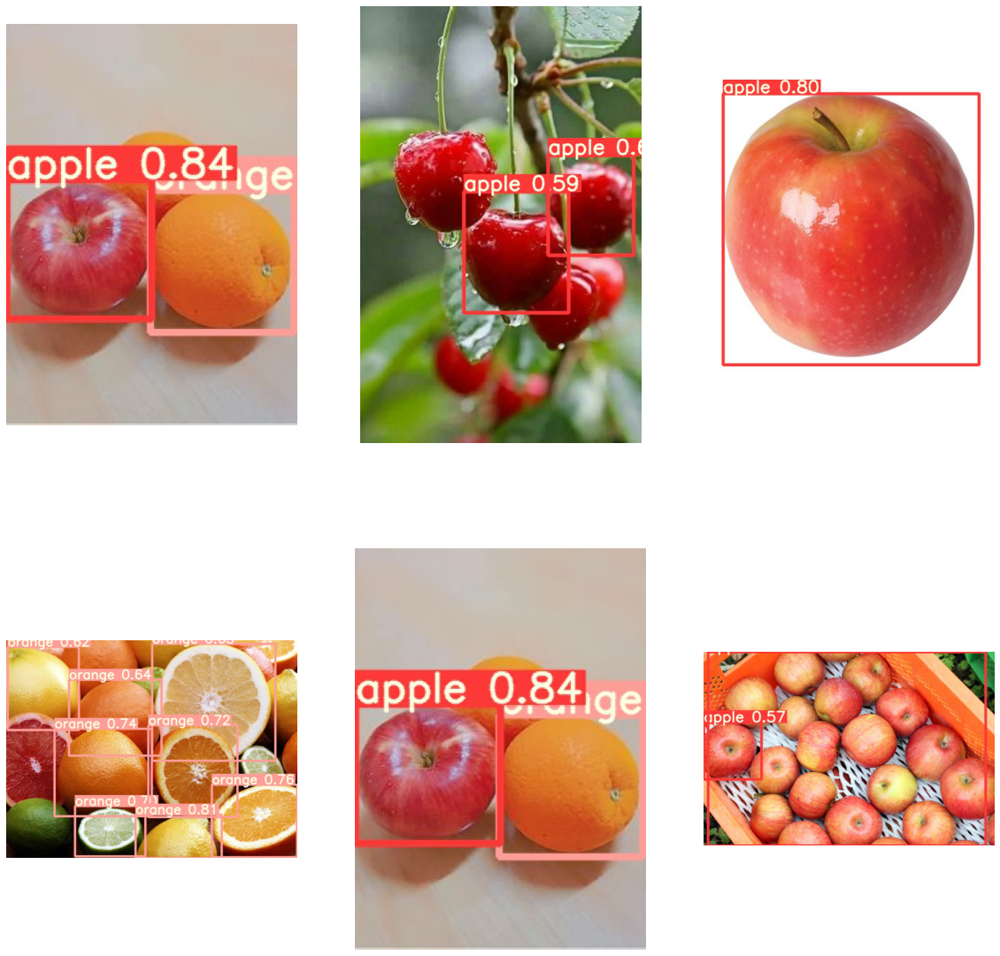

# AI_openImage_object_detection

#### object-detection model 학습중 dataset의 필요성을 많이 느꼈다. OIDv4_ToolKit에 수많은 이미지를 사용하면 좋을것같아서 사용해 보았다.(labeling이 되어있음) 


```python
#openImage인 OIDv4_ToolKit을 사용하기 위해 gitclone 활용
!git clone https://github.com/EscVM/OIDv4_ToolKit.git 
```

    fatal: destination path 'OIDv4_ToolKit' already exists and is not an empty directory.


```python
# 사과와 오렌지를 다운받아 학습 후 결과 detect
import matplotlib.pyplot as plt
import numpy as np
from glob import glob
import os
```


```python
result_img = glob('/workspace/Docker/yolov5_openImage/result_images/*.jpg')
len(result_img)
```


    6


```python
fig=plt.figure(figsize=(20,20))
columns = 3
rows = 2
for i in range(1, columns*rows +1):
    img = np.random.choice(result_img)
    img = plt.imread(img)
    fig.add_subplot(rows, columns, i)
    plt.axis('off')
    plt.imshow(img)
plt.show()
```


    

    


#### 결과 : resource상 epoch를 10번만 실행시켰다. 학습이 많이 되지 않아서 결과는 안좋으나 openimage를 다운받아 object-detection자체는 완료되었음을 확인하였다.
