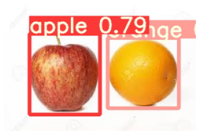

# OpenImage-ObjectDetection

```python
#openImage를 다운받기 위한 git clone
!git clone https://github.com/EscVM/OIDv4_ToolKit.git
```

```python
cd OIDv4_ToolKit
```

    /workspace/Docker/yolov5_openImagev5/OIDv4_ToolKit


```python
#관련 library등 install
!pip install -r requirements.txt

```

```python
#!python main.py downloader --classes Apple Orange --type_csv train --limit 5000 --multiclasses 1
# apple orange이미지 5000장 download
```


```python
#object detection을 하기위한 yolov5 git clone
!git clone https://github.com/ultralytics/yolov5.git
```


```python
#Train
```


```python
import matplotlib.pyplot as plt
import numpy as np
from glob import glob
import os
```

```python
!python detect.py --weight /workspace/Docker/yolov5_openImagev5/yolov5/runs/train/yolov5_AppleOrange3/weights/best.pt --img 416 --conf 0.5 --source "/workspace/ssddata/yolov5_openImage_dataset/test/"
```
    
    Fusing layers... 
    Model Summary: 224 layers, 7056607 parameters, 0 gradients, 16.3 GFLOPs
    image 1/6 /workspace/ssddata/yolov5_openImage_dataset/test/download.jpg: 288x416 1 apple, 1 orange, Done. (0.009s)
    image 2/6 /workspace/ssddata/yolov5_openImage_dataset/test/image1.jpg: 288x416 1 apple, 1 orange, Done. (0.006s)
    image 3/6 /workspace/ssddata/yolov5_openImage_dataset/test/image2.jpg: 256x416 1 apple, 1 orange, Done. (0.008s)
    image 4/6 /workspace/ssddata/yolov5_openImage_dataset/test/image3.jpg: 384x416 1 apple, Done. (0.009s)
    image 5/6 /workspace/ssddata/yolov5_openImage_dataset/test/images (1).jpg: 320x416 5 apples, Done. (0.008s)
    image 6/6 /workspace/ssddata/yolov5_openImage_dataset/test/images.jpg: 192x416 1 apple, 1 orange, Done. (0.010s)
    Results saved to runs/detect/exp9
    Done. (0.087s)


```python
result_img = glob('/workspace/Docker/yolov5_openImagev5/yolov5/runs/detect/exp9/*.jpg')
len(result_img)
```


    6


```python
img = plt.imread(result_img[2])
plt.imshow(img)
plt.axis('off')
plt.show()
```


    

    


```python

```
